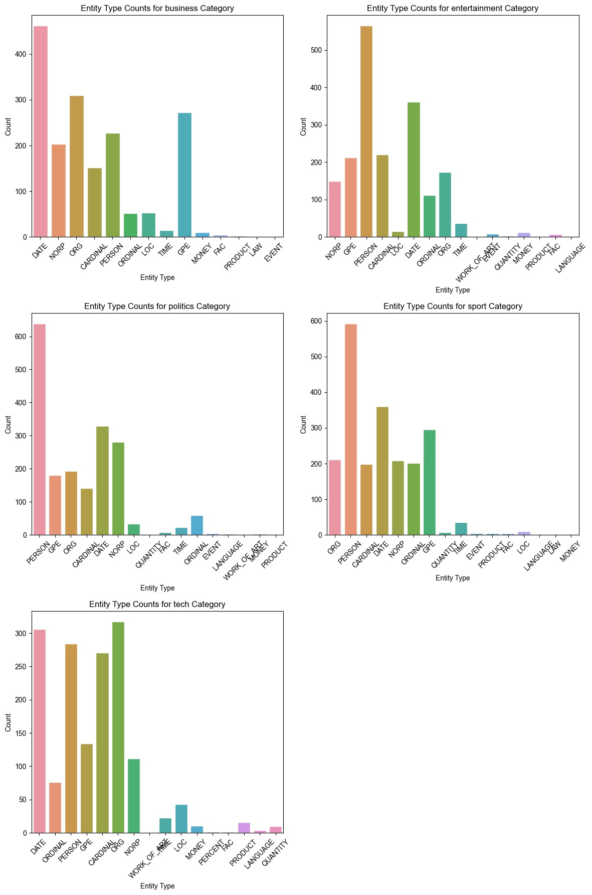
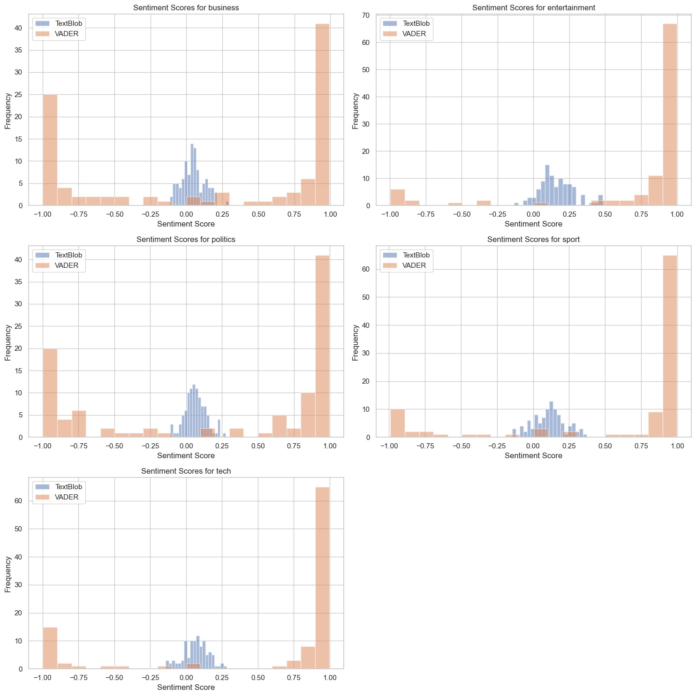
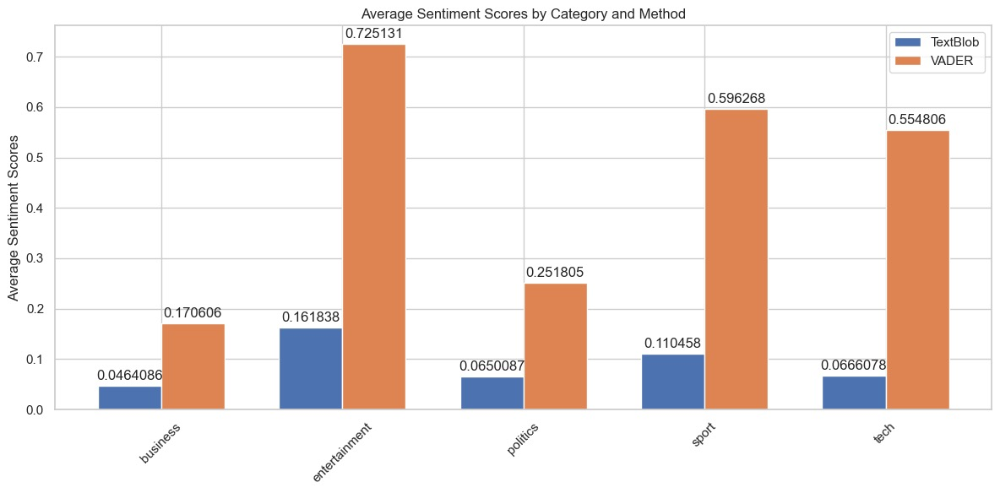
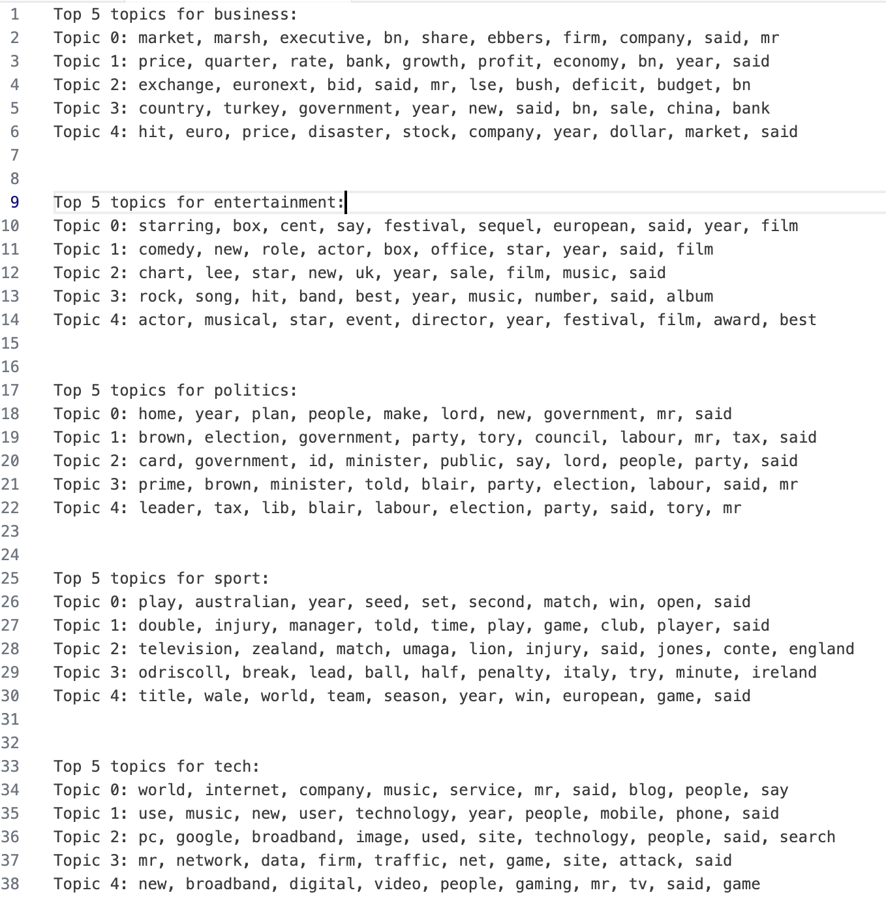

| [home page](https://valeriee37.github.io/NLXLLM-portfolio/) | [Quizzes](https://tbd.html) | [Individual Assignments](https://tbd.html) | [Group Project](https://tbd.html) |

# HW#1 Report - Text Classification Task

## A. Tools or Frameworks Used

1. NLTK: Leveraged for sentiment analysis using the VADER tool, which is tailored for social media text sentiment assessment.

2. spaCy: Utilized for efficient and accurate Named Entity Recognition (NER), categorizing entities within our texts.

3. TextBlob: Simple yet effective tool for sentiment analysis, offering an additional perspective on the sentiment expressed in our documents.

4. Matplotlib & Seaborn: These libraries created visualizations to illustrate our findings effectively, from entity distributions to sentiment analysis comparisons.

## B. Results Obtained
The analysis yielded three main types of results:

1. Entity Distribution:

The entity type counts showed a varied distribution across different categories. For instance, certain types of entities like DATE, ORG (organizations), and PERSON were more prevalent in specific categories, reflecting the thematic focus of each category.

2. Sentiment Analysis:

Both TextBlob and VADER were used to analyze sentiment. While the trend in sentiment (positive, neutral, or negative) was generally consistent across both methods, there was a noticeable discrepancy in the scores assigned by each tool. The bar plots illustrated these differences in sentiment distribution.

3. Average Sentiment Scores:

The comparison of average sentiment scores between TextBlob and VADER highlighted the variance in sentiment assessment. While one method might give a more moderate score, the other could show a more extreme sentiment for the same text.

## C. Analysis/Reflection on the Results

1. NER Analysis:

The entity distribution across categories indicated the concentration of specific themes and subjects within each category. For example, the business category may contain more ORG and MONEY entities, which aligns with the expectations for such content. Entities like companies, markets, and executives are often discussed in the context of financial performance and corporate strategy, which can be reflected in neutral to positive sentiments unless the article discusses economic challenges or corporate scandals.

2. Sentiment Analysis Discrepancies:

The sentiment analysis, utilizing both TextBlob and VADER, indicates that while there are variations in scores between the two methods, the sentiment trends are fairly consistent. From the histograms, it is observable that most sentiment scores cluster around the center, which suggests a predominance of neutral sentiments across the corpus. However, there is a presence of both positive and negative sentiments, albeit to a lesser extent.

The differing sentiment scores between TextBlob and VADER can be attributed to their underlying methodologies. VADER, with its emphasis on social media language, may interpret sentiment intensity differently than TextBlob, which uses a more general approach. This distinction can cause similar texts to receive varying sentiment scores from each tool, as observed in the visualizations.

3. Average Sentiment Score Comparison:

When we compare the average sentiment scores, we notice that some categories show a larger gap between the two tools than others. This variation could be influenced by the linguistic characteristics of the texts in each category. For example, texts with more nuanced language or ambiguous sentiment expressions might be scored differently by the two methods.

4. Sentiment topic relationship:

- Business: Topics concerning financial performance (e.g., market, growth, profit) and corporate activities (e.g., exchange, bid, sale) tend to be neutral to positive, reflecting factual reporting and objective discussions in the business domain. However, terms like "deficit," "disaster," and "hit" might relate to more negative sentiments, suggesting that negative news could influence the sentiment in this category.

- Entertainment: The topics are centered around films, music, and festivals, which are generally associated with positive sentiment. Words like "starring," "comedy," "chart," "hit," and "award" suggest positive events and achievements.

- Politics: Political topics tend to evoke a wider range of sentiments, from positive (e.g., "plan," "election") to negative (e.g., "tax," "id card," "deficit"). The presence of politicians' names (e.g., "Brown," "Blair") as entities might correlate with both positive and negative sentiments, depending on the context of the news and public opinion.

- Sport: Topics are often tied to competition results and performances (e.g., "win," "title," "seed"), which can be both positive (winning, leading) and negative (injury, defeat). The sentiment here is likely to be more polarized based on the outcomes of sporting events.

- Tech: Technology topics often carry a positive sentiment, associated with innovation and new products (e.g., "broadband," "digital," "mobile"). However, there can be neutral or negative sentiments when discussing issues like "data" security or "attack."

