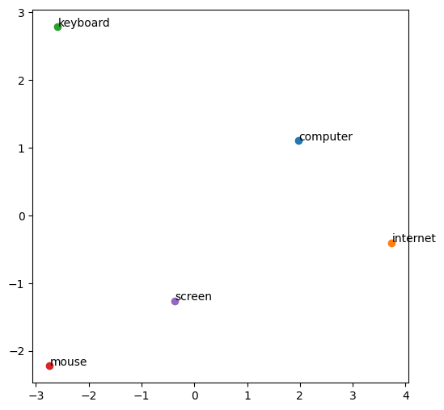
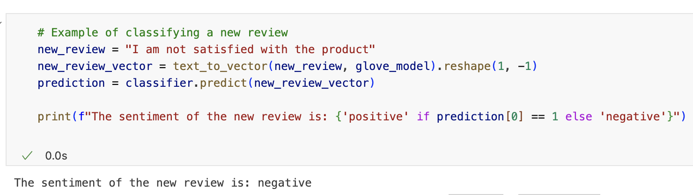

| [home page](https://valeriee37.github.io/NLXLLM-portfolio/) | [Individual Assignments](https://tbd.html) | [Group Project](https://tbd.html) |

# HW#2 Report - Embedding Space Exploration and Semantic Transformation

[Click to see the programming notebook](hw2.ipynb)

## Task Description

### Exploring Word Embeddings

Approach and Findings:

- Downloaded 100-dimensional GloVe vectors ([Dataset source](https://www.kaggle.com/datasets/rtatman/glove-global-vectors-for-word-representation)), chosen for their balance between computational efficiency and semantic richness.
- Selected words related to technology, such as "computer", "internet", and "software", to explore their semantic neighbors.
- Conducted vector arithmetic to uncover relational parallels, discovering that "king" - "man" + "woman" closely equates to "queen", illustrating the embeddings' capture of gender relationships.
- Nearest neighbor searches revealed clusters of semantically related terms, underscoring the embeddings' effectiveness in grouping conceptually similar words.

### Visualization of Embedding Spaces

Approach and Findings:

- Employed PCA for dimensionality reduction, effectively mapping high-dimensional vectors onto a 2D plane.

- Visual analysis of clusters confirmed the intuitive grouping of domain-specific terms.
- Distances between points served as a proxy for semantic similarity, with related terms like "email" and "message" being closer together.

### Application - Transforming Embeddings for a Specific Task

- Applied a `debias` function to the GloVe embeddings to address gender bias, aiming to create a more equitable NLP model.
- After debiasing, the embeddings were used to train a logistic regression model on a separate Kaggle dataset tailored for text classification.
- The model achieved an accuracy of **72.15%**, which serves as a benchmark to understand the impact of debiasing on NLP tasks.

- The comparison between the classification performance before and after debiasing suggested that the debiasing process preserved the utility of the embeddings while promoting fairness.

### Interpretation of Findings
The text classification task demonstrated that the debiased embeddings could be effectively utilized without compromising the model's performance. The accuracy obtained suggests that the embeddings, even after transformation, retained significant semantic information necessary for distinguishing between different sentiment classes.

### Reflection on Challenges
Incorporating bias reduction while maintaining the quality of the embeddings for downstream tasks such as text classification presented a multifaceted challenge. It was crucial to balance the removal of bias against the potential loss of semantic meaning that could affect classification performance.
