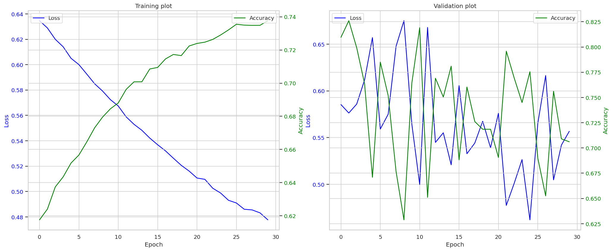
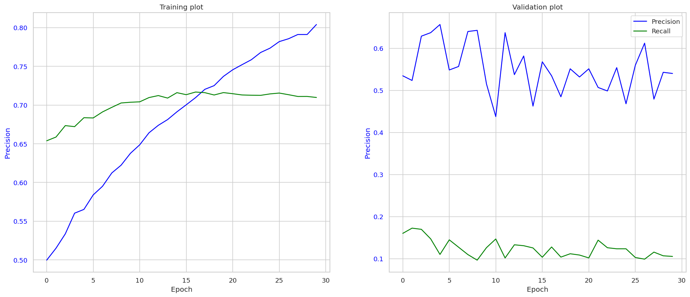
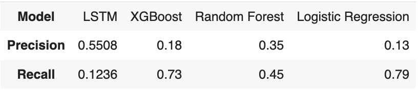

| [Home Page](https://valeriee37.github.io/NLXLLM-portfolio/) | [Individual Assignments](https://tbd.html) | [Group Project](https://tbd.html) |

# HW#3 Report - Hate Speech Detection

[Click to see the programming notebook](hate_speech_detection.ipynb)

[Click to navigate to the repo](https://github.com/VaLeRiEe37/NLXLLM-portfolio/edit/main/hw3)

## Task Description

### Data Preprocessing and Exploration

I used the `cleaned_df.pkl` from the source repo. Then processed the following during the process...

- Text normalization to convert text to a uniform case, remove special characters, and standardize language expressions.
- Removal of noise such as URLs, user mentions, and non-textual elements that do not contribute to the classification task.
- Addressing class imbalance through techniques like SMOTE or undersampling to ensure the model learns from a balanced representation of both classes.

### Model Implementation

I used LSTM model in this case due to its proficiency in handling sequential data and its ability to capture long-term dependencies. Key considerations in the model design included:

- Utilization of pre-trained word embeddings (from [BERT](https://huggingface.co/Hate-speech-CNERG/bert-base-uncased-hatexplain)) to enrich the model's understanding of semantic relationships within the text.
- Incorporation of dropout and regularization techniques to mitigate overfitting and enhance the model's generalization capabilities.

### Model Optimization and Evaluation

The evaluation metrics focused on were accuracy, precision, recall, and F1-score, with a particular emphasis on precision and recall to effectively measure the model's capability in detecting hate speech instances.

### Results and Insights

The precision and recall plot suggests that while the model learns to identify hate speech more precisely over time, its recall, especially on the validation data, remains low. The high variability in validation precision and the consistently low validation recall indicate the model's difficulty in generalizing the detection of hate speech to unseen data.

The loss and accuracy plot demonstrates that the model is improving on the training set but struggles to maintain consistent performance on the validation set. The fluctuations in validation loss and accuracy underscore the challenges of modeling with imbalanced data, emphasizing the need for a more nuanced evaluation of model performance, particularly in terms of how well it identifies the minority class (hate speech).

Both plots together suggest that while the LSTM model is learning to identify hate speech, its ability to do so is still constrained by the imbalanced nature of the dataset. Precision and recall are crucial metrics for this problem, and the model's relatively low recall on the training plot indicates that further work is needed to balance the trade-off between precision and recall. If I had more time to do, hyperparameter tuning, more training epochs, or techniques to address class imbalance could potentially lead to better model performance.

I also run some classic ML and below is the metrics comparison:

For LSTM, despite having the highest precision, has a very low recall, indicating that while it's cautious about labeling a comment as hate speech, it fails to detect many actual instances of it. This cautious approach can be due to the LSTM's sensitivity to the sequence of words and the context, which might make it more conservative in its predictions.

The observation that tree-based models with BERT embeddings perform well in detecting hate speech is interesting. BERT provides rich contextual embeddings which, when used with tree-based models, seem to capture the nuances of hate speech effectively, as indicated by their higher recall rates. The high recall suggests that these models, armed with the power of BERT embeddings, are able to recognize a broad variety of language patterns associated with hate speech.

If the primary concern is to minimize the presence of hate speech (minimize false negatives), a model with higher recall may be more desirable, even if it means accepting more false positives (lower precision). However, if it is crucial to maintain user engagement by minimizing wrongful censorship (minimize false positives), a model with higher precision would be preferable.

The choice of model could be further refined by tuning the decision thresholds, considering the costs of false positives versus false negatives, and perhaps combining models in an ensemble to leverage the strengths of each.

### References
- [Hate Speech Datasets](https://github.com/sidneykung/twitter_hate_speech_detection)
- [Pretrained BERT model from HuggingFace](https://huggingface.co/Hate-speech-CNERG/bert-base-uncased-hatexplain)
